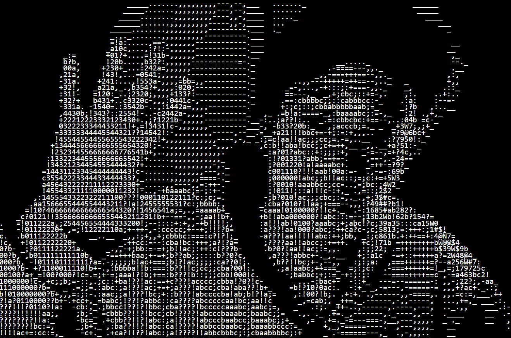

# ASCII Vision

ASCII Vision is a JavaScript application that converts video streams from the webcam into real-time ASCII art, using characters to represent brightness levels.

## 📖 Description

This project creates ASCII art by analyzing each pixel in a video stream and matching its brightness to a character in a defined "density" string. This method allows the transformation of the video into text-based art, where lighter areas are represented by less dense characters and darker areas by more solid characters.

## ⚙️ Technologies

The project is built with:
- **p5.js** for capturing video and pixel processing.
- **HTML** and **CSS** for displaying the ASCII art.

## 🚀 Installation and Usage

1. Clone the repository:
   ```bash
   git clone https://github.com/li-mikhail/ASCII_vision
   ```
2. Navigate to the project directory:
   ```bash
   cd ASCII_vision
   ```
3. Open `index.html` in a browser to start the project.

## 🛠 How It Works

1. **Video Capture**: The video stream is captured using `p5.js` and resized for better performance.
2. **Pixel Processing**: For each pixel, the average RGB value is calculated to determine its brightness.
3. **Character Mapping**: A density string is used where each character corresponds to a range of brightness.
4. **ASCII Display**: The final ASCII image is updated and rendered in a `div` element.

## 🔧 Configuration

- **density**: A string that defines character density to represent different brightness levels.
- **video.size()**: You can adjust the video stream size to balance between ASCII quality and performance.

## 🚨 Dependencies

The project depends on **p5.js**, included via CDN in `index.html`.

## 📸 Screenshots

<!-- 

 -->

Will be added soon.

## 🖋 Author

- [Mikhail](https://github.com/li-mikhail) - Project Author.